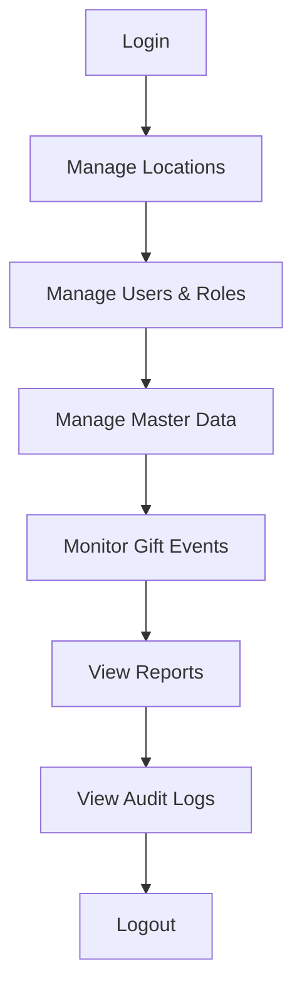
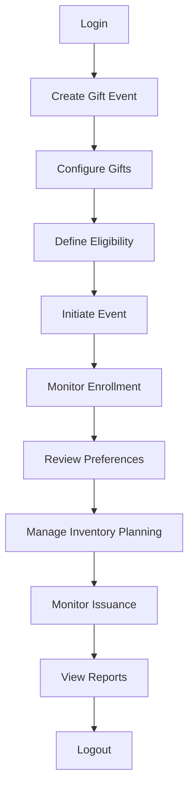
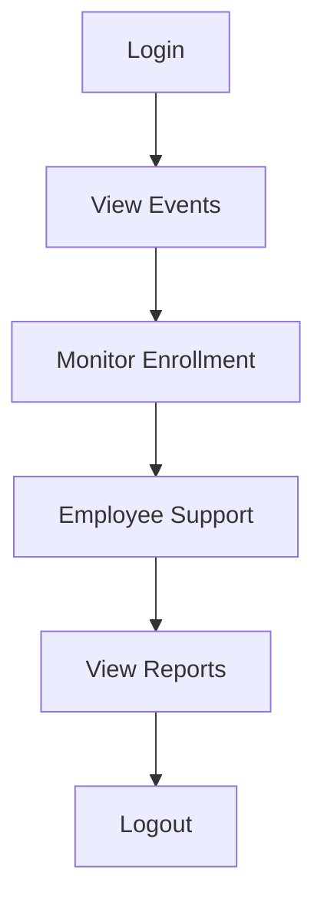
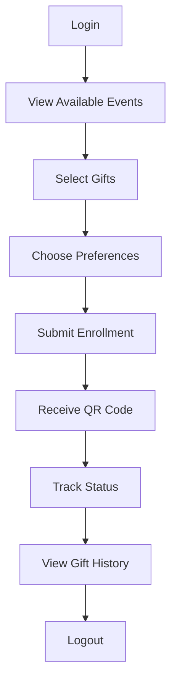
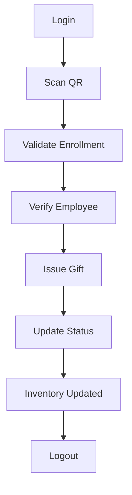

# System Design Overview

## Purpose

The Gift Management System digitizes the complete lifecycle
of employee gift distribution programs.

## Scope

- Authentication
- User Management
- Event Management
- Enrollment
- QR Management
- Gift Issuance
- Inventory
- Reports
- Audit Trail

## Stakeholders

- Global Admin
- HR Admin
- HR User
- Employee
- Facilities User
- Issuer
- Security User

## Architectural Goals

- Scalability
- Security
- Maintainability
- Auditability
- High Availability

## Technology Stack

Frontend:
React + TypeScript

Backend:
Node.js + Express

Database:
PostgreSQL

Authentication:
JWT + Refresh Token

Deployment:
Docker + AWS/VPS

CI/CD:
GitHub Actions

## Core System Modules
The application will contain the following major modules:
1. Login and User Management Module
2. Dashboard Module
3. Master Data Management Module
4. Gift Event Configuration Module
5. Gift Item and Combo Configuration Module
6. Target Employee / Beneficiary Configuration Module
7. Employee Enrolment Module
8. Email Notification Module
9. QR Code Generation Module
10. Gift Issuance and Tracking Module
11. Inventory / Stock Management Module
12. Withdrawal and Reissue Module
13. Announcement Module
14. MIS Reports Module
15. Audit Trail Module
16. Exception Handling and Logging Module

## User Roles

| Role | Description |
|------|-------------|
| Global Admin | Full access to all modules and all locations. Responsible for overall system administration, user management, master data management, event monitoring, reporting, and audit review. |
| HR Location Admin | Full access to all HR-related modules for assigned locations. Can create gift events, manage employee eligibility, monitor enrollments, manage inventory, and view reports for assigned locations. |
| HR User | Operational access for assigned locations. Can assist in event execution, employee communication, enrollment monitoring, and report generation based on assigned permissions. |
| Issuer | Responsible for gift distribution. Can validate QR codes, verify employee details, issue gifts, and update issuance status. |
| Employee | Can view available gift events, enroll in events, select gift preferences, withdraw enrollment, view QR codes, and track gift issuance status. |
| Facilities User | Responsible for inventory and stock management. Can monitor stock availability, stock movement, stock reconciliation, and inventory reports. |
| Security User | Limited operational access. Can verify employee identity, validate event participation, and access restricted operational reports where applicable. |

## External Services

- Email Service
- QR Generator

## User Workflows

# 1. Global Admin Workflow

# Responsibilities
• Create locations.
• Create HR users.
• Assign HR users to locations.
• Manage master data.
• View and manage all gift events across locations.
• View all reports.
• Manage role-based permissions.
• Configure system-wide settings.

# 2. HR Location Admin Workflow

# Responsibilities
HR users are attached to one or more locations.
• Create and manage gift events for their assigned location.
• Upload eligible employees.
• Select target employees from master data.
• Configure gift items.
• Send announcements.
• Record gift issuance.
• Record gift withdrawal.
• View gift history of employees in their location.
• Generate reports for their assigned location.

# 3. HR User Workflow

# Responsibilities
- Operational Support
- Enrollment Monitoring
- Employee Assistance
- Location Reporting

# 4. Employee Workflow

# Responsibilities

- View available gift events.
- Enroll for gift events.
- Enter required gift preferences.
- Withdraw from a gift event.
- View current gift status.
- View gift history.

# 5. Issuer Workflow

# Responsibilities

• View events assigned to their location.
• Scan QR codes during gift distribution.
• Mark gifts as issued.
• Record pending, withdrawn, or reissued status where allowed.
• View limited issuance-related data

# Overall Business Architecture

``` mermaid
flowchart TD

A[HR Login] --> B[Create Gift Event]

B --> C[Enter Event Details]
C --> D[Configure Gift Items]
D --> E[Define Target Employees]
E --> F[Configure Email Template]

F --> G[Save Event]
G --> H[Event Status = Created]

H --> I[Initiate Event]

I --> J{Validation Successful?}

J -->|No| K[Display Validation Errors]
K --> I

J -->|Yes| L[Event Status = Initiated]

L --> M[Send Event Emails]
M --> N[Create Email Logs]

N --> O[Employee Receives Email]

O --> P[Employee Login]
P --> Q[View Event Details]
Q --> R[Select Gift Preferences]

R --> S[Submit Enrollment]

S --> T{Enrollment Valid?}

T -->|No| U[Display Validation Errors]
U --> R

T -->|Yes| V[Generate QR Code]

V --> W[Send Confirmation Email]
W --> X[Status = Enrolled / Pending Issuance]

X --> Y[HR Opens Issuance Phase]

Y --> Z[Event Status = Issuance]

Z --> AA[Employee Visits Collection Center]

AA --> AB[Issuer Scans QR]

AB --> AC{QR Valid?}

AC -->|No| AD[Reject QR]
AD --> AB

AC -->|Yes| AE[Display Employee & Gift Details]

AE --> AF[Confirm Gift Distribution]

AF --> AG[Mark Gift as Issued]

AG --> AH[Record Issue Date Time & Issuer]

AH --> AI[Update Inventory]

AI --> AJ[Create Audit Record]

AJ --> AK{Withdraw Request?}

AK -->|Yes| AL[Withdraw Enrollment]
AL --> AM[Update Status = Withdrawn]
AM --> AN[Adjust Stock Allocation]
AN --> AO[Create Audit Record]

AK -->|No| AP[Continue]

AO --> AQ[Event Review]
AP --> AQ

AQ --> AR[HR Reviews Event]

AR --> AS[Verify Pending & Issued Records]

AS --> AT[Close Event]

AT --> AU[Event Status = Closed]

AU --> AV[No Further Enrollment or Issuance Allowed]

AV --> AA


```

flowchart LR

%% ===================================
%% USERS
%% ===================================

GA[Global Admin]
HRA[HR Admin]
HRU[HR User]
EMP[Employee]
ISS[Issuer]
FAC[Facilities User]
SEC[Security User]

%% ===================================
%% FRONTEND
%% ===================================

subgraph Frontend["React Frontend"]

UI[Web Application]

end

%% ===================================
%% BACKEND
%% ===================================

subgraph Backend["Node.js + Express API"]

AUTH[Authentication & Authorization]

USERS[User Management]

MASTER[Master Data Management]

EVENTS[Gift Event Management]

ENROLL[Enrollment Management]

ISSUANCE[Gift Issuance]

INVENTORY[Inventory Management]

REPORTS[Reporting & Analytics]

AUDIT[Audit Trail & Logging]

NOTIFY[Notification Service]

end

%% ===================================
%% DATABASE
%% ===================================

subgraph Database["PostgreSQL"]

DB[(Gift Management Database)]

end

%% ===================================
%% EXTERNAL SERVICES
%% ===================================

subgraph ExternalServices["External Services"]

QR[QR Code Generator]

MAIL[Email Service]

end

%% ===================================
%% USER ACCESS
%% ===================================

GA --> UI
HRA --> UI
HRU --> UI
EMP --> UI
ISS --> UI
FAC --> UI
SEC --> UI

%% ===================================
%% FRONTEND TO BACKEND
%% ===================================

UI --> AUTH

%% ===================================
%% BUSINESS FLOW
%% ===================================

AUTH --> USERS

AUTH --> MASTER

AUTH --> EVENTS

AUTH --> ENROLL

AUTH --> ISSUANCE

AUTH --> INVENTORY

AUTH --> REPORTS

AUTH --> AUDIT

%% ===================================
%% MODULE INTERACTIONS
%% ===================================

EVENTS --> ENROLL

ENROLL --> ISSUANCE

ISSUANCE --> INVENTORY

EVENTS --> NOTIFY

ENROLL --> NOTIFY

%% ===================================
%% DATABASE ACCESS
%% ===================================

USERS --> DB

MASTER --> DB

EVENTS --> DB

ENROLL --> DB

ISSUANCE --> DB

INVENTORY --> DB

REPORTS --> DB

AUDIT --> DB

NOTIFY --> DB

%% ===================================
%% EXTERNAL INTEGRATIONS
%% ===================================

ENROLL --> QR

NOTIFY --> MAIL

# Frontend Modules (React)

These are the major screens/features visible to users.

1. Authentication Module
- Login
- Forgot Password
- Reset Password
- Profile
- Change Password
2. Dashboard Module

Different dashboards based on role.

- Global Admin Dashboard
- HR Admin Dashboard
- HR User Dashboard
- Employee Dashboard
- Issuer Dashboard
- Facilities Dashboard
- Security Dashboard
3. User Management Module
- Create User
- Edit User
- Assign Roles
- Assign Locations
- User Search
- User Status Management
4. Master Data Management Module
- Locations
- Departments
- Designations
- Grades
- Categories
- Units
- Financial Years
5. Gift Event Management Module
- Create Event
- Edit Event
- View Event
- Initiate Event
- Close Event
- Event History
6. Gift Catalog Module
- Gift Items
- Gift Combos
- Gift Attributes
- Gift Images
7. Employee Eligibility Module
- Target Employee Selection
- Eligibility Rules
- Bulk Upload
- Employee Assignment
8. Enrollment Module
- View Available Events
- Enroll
- Select Preferences
- Withdraw Enrollment
- Enrollment Status
9. QR Module
- View QR
- Download QR
- QR Status
10. Gift Issuance Module
- QR Scan Screen
- Employee Verification
- Issue Gift
- Issue History
11. Inventory Module
- Stock Overview
- Stock Allocation
- Stock Adjustment
- Stock Transactions
12. Reports & Analytics Module
- Enrollment Reports
- Preference Reports
- Issuance Reports
- Inventory Reports
- Location Reports
- Export Reports
13. Audit Trail Module
- User Activity Logs
- Event Logs
- Stock Logs
- Audit Reports
14. Communication Module
- Email Templates
- Email History
- Announcement Management

# Backend Modules (Express + MVC)

These are the folders inside src/modules.

1. Auth Module
- login
- logout
- refreshToken
- changePassword
- forgotPassword
2. User Module
- users
- roles
- userRoles
- userLocations
3. Master Data Module
- locations
- departments
- designations
- grades
- categories
- units
- financialYears
4. Employee Module
- employees
- employeeImport
- employeeLookup
5. Gift Event Module
- giftEvents
- giftEventItems
- giftCombos
6. Eligibility Module
- targetEmployees
- eligibilityRules
7. Enrollment Module
- enrollments
- preferences
- withdrawals
8. QR Module
- generateQR
- validateQR
- qrHistory
9. Gift Issuance Module
- issuance
- reissue
- reversal
10. Inventory Module
- stock
- stockTransactions
- stockAdjustments
11. Notification Module
- emails
- announcements
- emailLogs
12. Reporting Module
- enrollmentReports
- issuanceReports
- inventoryReports
- auditReports
13. Audit Module
- auditLogs
- applicationLogs

